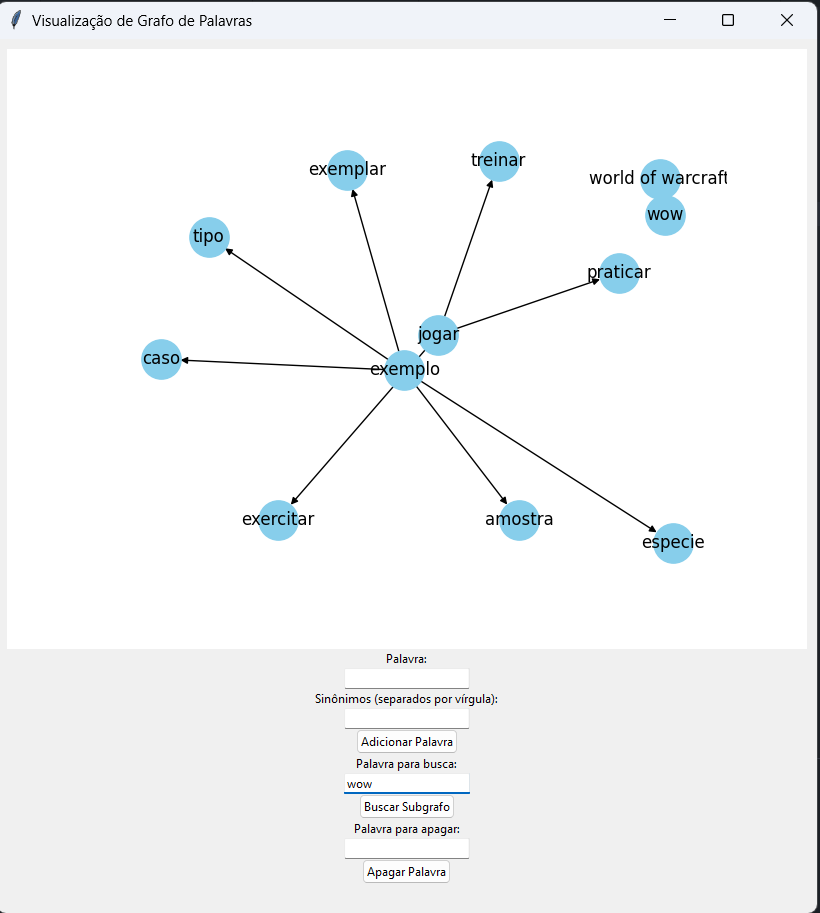

# Grafos1-Sinônimos

Temas:
 - Grafos1 

# Sinônimos


## Alunos
|Matrícula | Aluno |
| -- | -- |
| 19/0036427  |  Pedro Henrique Caldeira de Moraes |
| 17/0114139  |  Samuel Victor Castro Macêdo |

## Sobre 
Sinônimos é um projeto basico para mostrar palavras semelhantes utilizando grafos direcionados. 

## Screenshots





## Instalação 
**Linguagem**: Python<br>

**Dependências**
- Python 3.10.0 ou superior
- instalar as bibliotecas necessárias.
  
**Execução**
- Clone o projeto (ou baixe):
  
  ```shell
  git clone https://github.com/projeto-de-algoritmos/Grafos1_Sinonimos.git 
  && cd Grafos1_Sinonimos/
  ```
- Instale as bibliotecas necessárias:
    ``` 
    pip install networkx
    pip install matplotlib 
    sudo apt get install python3-tk
    ```
 
 - Execute o arquivo principal ```sinonimos.py```:
  
    ```shell
    cd Scripts
    python3 sinonimos.py 
    ```


## Uso 
1. Escreva a palavra desejada no campo "Palavra" 
2. Adicione os sinônimos da palavra no campo "Sinônimos", se tiver mais de um, separe por virgulas e clique no botão "Adicionar palavra"
3. Busque por uma palavra e um frafo especifíco no botão "Buscar Subgrafo"
4. Apague uma palavra do grafo no botão "Apagar palavra"
5. Brinque do jeito que quiser com os grafos.
6. Para ver os grafos de forma completa clique no botão 

## Apresentação


